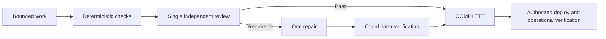

# Bearing Lite

[](https://www.npmjs.com/package/@alphazede/bearing-lite)
[](LICENSE-APACHE)

**Bearing Lite** (`@alphazede/bearing-lite`) is a skills-first Agent Plugin for
planning, routing, bounded execution, and independent review of repository work.
It ships portable skills, references, templates, and optional client hooks.

An agent cannot certify its own work. The stateful Router owns the planning
conversation, visible Journey state, and Expedition sequencing. Crewmate and
Explorer may continue in-wave when the envelope is unchanged. Independent
assurance runs once at the end on the final integrated candidate. One repair
may follow; it is verified deterministically without another review. Owner
Authority remains human-only.

Bearing Lite was created by William Rumph.

## Quick start with Pi

Install the published skills package:

```sh
pi install npm:@alphazede/bearing-lite
```

Then give your agent a real task:

> Use Bearing Lite to add rate limiting to this API without changing its public
> responses. Require one independent review at the end.

Bearing Lite fills missing planning stages, then Map the Route creates the
complete five-artifact package (`<journey-topic>-technical-plan.md`,
`design.md`, `seit.json`, `implementation.json`, and two-state `review.html`)
with proposed route, lineup, role states, reasoning, and at-end cadence. One
integrated owner review approves or changes that package before bounded
sessions dispatch with visible Markdown state.

If Bearing Lite helps keep a long agent task scoped and reviewable,
[star the repository](https://github.com/alphazede/bearing-lite). It helps other
coding-agent users find it.

## Install

Install as a host plugin. The portable identity is always `bearing-lite` /
`@alphazede/bearing-lite`. No postinstall script, global hook copy, or
host-config mutation is required.

```sh
# Claude Code
claude plugin marketplace add /path/to/bearing-lite
claude plugin install bearing-lite@bearing-lite

# Codex
codex plugin marketplace add /path/to/bearing-lite
codex plugin add bearing-lite@bearing-lite

# Grok Build
grok plugin marketplace add /path/to/bearing-lite
grok plugin install bearing-lite --trust

# Cursor
# Add the checkout as a Cursor marketplace/plugin (.cursor-plugin/)

# Kimi Code
# /plugins install /path/to/bearing-lite

# AGY (Antigravity) — install the .agy root, not the repo root
agy plugin install /path/to/bearing-lite/.agy

# Pi — skills package, no command hooks
pi install npm:@alphazede/bearing-lite

# DeepCode — discover the packaged skills through ~/.deepcode/skills or ~/.agents/skills;
# DeepCode has no plugin-install or command-hook surface
```

Claude Code, Codex, Grok Build, Cursor, and Kimi Code are **partial** hook
clients: session start runs the activation advisory and stop runs the closeout
advisory. AGY, Pi, and DeepCode are **skills-only**. Transition-order and
protected-action checks stay in the skills on every host. Node.js must be on
`PATH` for the hook adapters.

Planning-review constraints live only in
[`skills/bearing-lite/references/review-policy.md`](skills/bearing-lite/references/review-policy.md);
the shared evaluator is `hooks/planning-review.cjs`. Journey-specific abstract
slot IDs and owner-selected primary/ordered fallback route references belong
only in the approved `lineup_snapshot`. Existing host mappings cannot safely
derive the nested record from session events, so they preserve partial or
skills-only coverage and apply this gate procedurally. Planning review is a
pre-dispatch plan gate; implementation `max_assurance_rounds` remains separate.

**Skills-only copy** of `skills/` into a host skills directory does not
register hooks. That path remains first-class. See
[`hooks/com.anthropic.claude-code/mapping.md`](hooks/com.anthropic.claude-code/mapping.md).

## What it does

1. **Fill only missing planning stages:** Repository Fit → Set Bearings → Gather
   Supplies.
2. **Invoke Map the Route** after material intent is settled. It creates
   technical-plan, `design.md`, `seit.json`, `implementation.json`, and
   two-state `review.html` together.
3. **Review once:** approve or change the proposed route, user-owned
   primary/fallback lineup, role states, reasoning, at-end cadence, and plan.
4. **Dispatch bounded sessions** with compact receipts. Crewmate and Explorer may
   continue in-wave; assurance always starts fresh at the end.
5. **Record state visibly** in human-readable Markdown artifacts only.

Bearing Lite never selects models, providers, credentials, or launchers. The
owner provides each role's primary/fallback agent or harness, model, and
reasoning level in `~/.agents/bearing-lite/default-role-lineup.md`, then confirms
the applicable Journey snapshot before implementation.

## Routes and scaling

| Route | When | Cost |
|---|---|---|
| **Explorer Journey** | One bounded packet or one wave | Direct Crewmate or one Explorer |
| **Expedition** | Multi-phase or concurrent independent lanes | Router sequences; Explorer owns waves |

An **Explorer Journey** uses a direct Crewmate for one ready packet or one
Explorer over a compact/sequential wave.
**Expedition** lets the Router sequence waves so independent lanes
stay small and sharp instead of degrading in one long context. Either shape can
use substantial tokens; the product does not impose a default budget ceiling.

### Role routing (explanatory)

Current routing diagram source: [`skills/bearing-lite/references/role-routing.mmd`](skills/bearing-lite/references/role-routing.mmd).
The text below remains authoritative for clients that do not render Mermaid.

**Authoritative text (vision optional):** Owner Authority remains human-only. The
Bearing Lite Router is the stateful planning controller, not a work role. It
invokes only missing planning stages, has Map the Route generate all five
artifacts with proposed lineup and `review_cadence: at-end`, then presents one
integrated owner review before dispatching an Explorer Journey or Expedition. Explorer
coordinates proven-independent in-wave lanes without a nested coordinator.
Assurance Test Engineer, Park Ranger, and Surveyor appear only when declared
and only at the end on the final integrated candidate. Diagrams
explain orientation; they never authorize a transition.

## Roles and authority

| Role | What it is | Executes | Notes |
|---|---|---|---|
| **Router** | Stateful planning controller | no | User-facing; planning-state writer; Expedition sequencing |
| **Navigator** | Compatibility diagnostic | no | Not a normal role; existing plans reroute to Router |
| **Explorer** | One-wave controller | no | Dispatches Crewmates; owns proven-independent lanes |
| **Crewmate** | Bounded implementer | yes | Split test-writing versus product; neither self-certifies |
| **Scribe** | Event side lane | no | Transcribes; cannot activate authority |
| **Plan Integrator** | Artifact reconciliation | no | Generates `implementation.json` and `review.html` |
| **Systems Modeler** | Engineering views | no | After requirements; before design finalization |
| **Integration Engineer** | Progressive assembly | no | Dual planning and execution sessions |
| **Test Engineer** | Planning and Assurance V&V | no | Retires Validator; Validator is not an active role |
| **Park Ranger** | Defect review | no | Consumes Assurance Test Engineer; no routine TE |
| **Surveyor** | User-facing acceptance | no | Read-only RE, SysML Modeling, and TE |
| **Owner Authority** | Human decision | n/a | Never an agent role |

**Independent review:** a candidate author never provides their own Assurance
Test Engineer, Park Ranger, or Surveyor verdict.

Public Bearing Lite remains usable without AlphaZede-specific skills
(`requirements-engineering`, `sysml-modeling`, `test-engineering`,
`integration-engineering`). Specialized capabilities activate when selected
or required. Unavailability of a selected-or-required capability is a typed capability gap,
not success and not invented behavior. Selected-only missing and required-only
missing are each typed gaps. Only unselected and unrequired absence remains
inactive / not a global failure.

Failure escalates to the nearest role whose scope can see it:

| Failure scope | Escalates to |
|---|---|
| Within one slice or packet | Explorer or nearest parent |
| Across slices in a wave | Explorer |
| Across waves or phases | Router |
| Contract, security, or authority change | Owner Authority |

## Task state (explanatory)

Current task-state diagram source: [`skills/bearing-lite/references/task-state.mmd`](skills/bearing-lite/references/task-state.mmd).
The text below remains authoritative for clients that do not render Mermaid.
Authoritative transition rules: [`skills/bearing-lite/references/task-state.md`](skills/bearing-lite/references/task-state.md).

**Authoritative summary:** The project's plan is the only task-state record.
Normal progress is `PROPOSED` → `READY` → `IN_PROGRESS` → `EVIDENCE_READY`, then
optional `VALIDATING` / `REVIEWING` when required, then `ACCEPTANCE` →
`COMPLETE`. `WAITING_ON` holds for missing prerequisites, checkout-lease
conflict, or assurance dispatch.
Ordinary execution corrections remain bounded. The assurance gate allows one
review-directed repair, followed by deterministic coordinator verification and
no second review. Diagrams never create state or authorize transitions.

## Implementation process (explanatory)

Default packet completion is author self-check plus coordinator confirmation.
Declared independent assurance runs once at the end. A repairable
verdict permits one repair; deterministic coordinator verification then closes
the gate without another review. Once the Journey is `COMPLETE`, an already
authorized deployment proceeds with operational checks and rollback readiness,
not a new assurance round. Source-changing deployment work is separate work.



## Package layout

| Path | Purpose |
|---|---|
| `plugin.json` | Agent Plugins v1.0.0 manifest |
| `skills/` | Router, planning stages, and role skills |
| `hooks/` | Four portable class adapters plus the verified Claude Code / Codex mapping |
| `lineups.json` | Empty shipped catalog; no packaged providers, models, or defaults |
| `schemas/` | JSON Schema for `seit.json`, `implementation.json`, `authority.json`, and `journey.json` |
| `README.md` and governance docs | Public product and conduct surfaces |

There is no `mcp.json`, `bin` entrypoint, postinstall, or runtime dependency on
another product's state.

## Provider neutrality

Skills declare **capabilities** (reasoning depth, repository access, mutation
tools, independence, optional vision). They never pin a model, provider API key,
default route, or launcher. Owners and clients choose how to satisfy each role.

## Contributing

Issues and carefully scoped pull requests help. See
[CONTRIBUTING.md](CONTRIBUTING.md). Everyone is covered by the
[Code of Conduct](CODE_OF_CONDUCT.md).

## Security

Report suspected vulnerabilities privately—not in a public issue. See
[SECURITY.md](SECURITY.md).

## License

Licensed under the [Apache License 2.0](LICENSE-APACHE).
