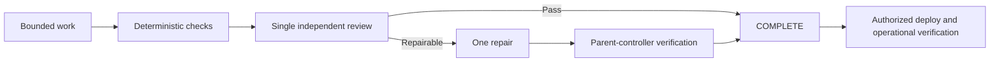

# Bearing Lite

[](https://www.npmjs.com/package/@alphazede/bearing-lite)
[](LICENSE-APACHE)

**Bearing Lite** (`@alphazede/bearing-lite`) is a skills-first [Agent
Plugins](https://agent-plugins.org/schemas/1.0.0/plugin.schema.json) package
that gives AI-assisted repository work a structured delivery lifecycle from
an owner-approved plan to an independently assessed result. It improves
repeatability and reduces hallucination risk through bounded
implementation, deterministic checks, verification, validation, independent
assurance, and traceable evidence. Planning artifacts and the Definition of
Done Manifest compare what AI was authorized to touch with actual changes,
supporting evidence, and unresolved gaps. It ships portable skills,
references, templates, and optional client adapters. An agent cannot certify
its own work. Owner Authority remains human-only. Bearing Lite was created
by William Rumph.

## Situation

Teams now ask coding agents to change real repositories. The work needs a
visible plan, exact write sets, deterministic checks, and independent
assessment before anyone treats the result as done.

## Complication

Unbounded agent sessions invent architecture, skip owner decisions, mix
implementation with self-review, and leave no comparable record of what was
authorized versus what changed.

## Question

How can AI-assisted repository work follow one input-to-evidence path that
stays reviewable, portable, and bounded without pinning a provider?

## Answer

Use the Bearing Delivery Lifecycle: Intake → Architectural Alignment → Scope Definition → Planning and Design, then owner authorization, bounded
implementation, Test Engineer assurance, Reviewer defect review, and
Integration Engineer execution assessment. Persistent configuration is
`~/.agents/bearing-lite/profiles.json` only. The Definition of Done Manifest
is the human-readable projection of planned versus actual work; it never
grants execution, acceptance, release, or deployment authority.

Focused pages:

- Explanation: [lifecycle guide](docs/guides/lifecycle.md)
- Reference: [roles and sessions](docs/guides/roles.md),
  [lifecycle specification](docs/architecture/bearing-delivery-lifecycle.md)
- Troubleshooting: [wait, resume, and configuration](docs/guides/troubleshooting.md)
- Process diagrams:
  [lifecycle context](docs/architecture/bearing-process/lifecycle-context.svg),
  [planning and implementation](docs/architecture/bearing-process/lifecycle-process-views.svg)

If Bearing Lite helps keep a long agent task scoped and reviewable,
[star the repository](https://github.com/alphazede/bearing-lite).

## Onboarding

1. Install the plugin or copy `skills/` into a host skills directory.
2. Run **onboard-bearing**. It asks one setting at a time, never selects or
   writes a value without an explicit instruction, and preserves every
   unaddressed existing value.
3. Configure named role and session routes, fallbacks, development strategy
   (`single_implementer` or `tdd`), planning review, assurance cadence,
   concurrency, the planning-to-implementation clean-session boolean, holds,
   and optional Reverify. Enabling Coordinator adds value only when a wave has
   two or more proven-independent packets, shared wave evidence to integrate
   once, or aggregate repair ownership; an explicit disabled choice is allowed,
   and disabling Coordinator on a true direct packet is not a capability gap.
   No value is preselected.
4. If you decline Reverify or decline its download, onboard-bearing persists
   `reverify.enabled: false` for that named profile and does not ask again
   during ordinary Lifecycles. Reverify is an optional third-party backend.
   Bearing Lite does not bundle, download, or install it, and never invokes
   it; the adapter only judges receipts a caller produces.
5. A leftover `~/.agents/bearing-lite/lineups.json` is not live configuration.
   Runtime returns `MIGRATION_REQUIRED` until onboard-bearing migrates it.

The only persistent Bearing user configuration is
`~/.agents/bearing-lite/profiles.json`. Runtime never searches, merges,
prefers, or falls back to `lineups.json`.

Some agent harnesses may stall after delegated work completes. Before
restarting the task, check whether the assigned agent is still active and
avoid duplicate dispatch. Wait/status reliability varies by host and route;
use a host-native status check when one exists. Missing expensive models or
wrappers do not make a route ineligible.

## Quick start

Install the published skills package:

```sh
pi install npm:@alphazede/bearing-lite
```

Then give your agent a real task:

> Use Bearing Lite to add rate limiting to this API without changing its public
> responses. Require independent assurance at the configured cadence.

Bearing Lite fills missing planning stages, then Planning and Design creates
the complete five-artifact package (`<lifecycle-topic>-technical-plan.md`,
`design.md`, `seit.json`, `implementation.json`, and
`<plan-name>-dod-manifest.html`) with proposed route, profile, role states,
reasoning, and cadence. One integrated owner review approves or changes that
package before bounded sessions dispatch, with visible Markdown task state
over those JSON authorities.

## Install

Install as a host plugin. The portable identity is always `bearing-lite` /
`@alphazede/bearing-lite`. No postinstall script, global hook copy, or
host-config mutation is required. Host-specific plugin manifests and
discovery remain host contracts; this README does not replace them.

### Plugin with hooks

Claude Code, Codex, and Grok Build install from a local checkout and load
session-start activation and stop closeout hooks.

```sh
# Claude Code
claude plugin marketplace add /path/to/bearing-lite
claude plugin install bearing-lite@bearing-lite

# Codex
codex plugin marketplace add /path/to/bearing-lite
codex plugin add bearing-lite@bearing-lite

# Grok Build
grok plugin marketplace add /path/to/bearing-lite
grok plugin install bearing-lite --trust
```

### UI or TUI plugin installation

These hosts install through their own UI or TUI. They are still plugin
clients, not a skills-only copy.

**Cursor.** Open Customize in the sidebar, find the plugin, and select
Install for a project or user scope. The shipped layout is
`.cursor-plugin/`. For a local checkout, link the repository into Cursor's
documented local-plugin directory, then restart Cursor or run **Developer:
Reload Window**:

```sh
mkdir -p ~/.cursor/plugins/local
ln -s /path/to/bearing-lite ~/.cursor/plugins/local/bearing-lite
```

**Kimi Code.** In the TUI, run `/plugins install /path/to/bearing-lite`.
Kimi Code has no `kimi plugin` CLI.

**GitHub Copilot in VS Code.** Run **Chat: Install Plugin From Source** from
the Command Palette and enter a Git repository URL such as
`https://github.com/alphazede/bearing-lite`. See [Agent plugins in VS
Code](https://code.visualstudio.com/docs/agent-customization/agent-plugins).
The package is Agent Plugins 1.0 `plugin.json` plus
`com.github.copilot/hooks/hooks.json`. VS Code also discovers plugins installed
by GitHub Copilot CLI after a new window or reload.

### CLI plugin installation

GitHub Copilot CLI requires Node.js 22 or later. Qwen Code accepts the
published Agent Plugins package directly.

```sh
# GitHub Copilot CLI
npm install -g @github/copilot
copilot plugin marketplace add alphazede/bearing-lite
copilot plugin install bearing-lite@bearing-lite

# Qwen Code
qwen extensions install @alphazede/bearing-lite
```

### Skills-only installation

AGY, Pi, DeepCode, and Muse Code load skills without command hooks.

```sh
# AGY (Antigravity) — install the .agy root, not the repo root
agy plugin install /path/to/bearing-lite/.agy

# Pi — published skills package
pi install npm:@alphazede/bearing-lite

# Muse Code — no plugin subsystem; install each skill
for skill in /path/to/bearing-lite/skills/*/SKILL.md; do
  muse skills install "$(dirname "$skill")" --scope user
done
```

**DeepCode** has no plugin-install or command-hook surface. Copy `skills/`
into `~/.deepcode/skills` or `~/.agents/skills`.

Claude Code, Codex, Grok Build, Cursor, Kimi Code, and GitHub Copilot clients
are **partial** hook clients: session start runs the activation advisory and
stop runs the closeout advisory. GitHub Copilot also has the implemented Test
Engineering channels `PreToolUse`, `Stop`, and `SubagentStop`. Qwen Code, AGY,
Pi, DeepCode, and Muse Code are **skills-only**. Qwen installs the root Agent
Plugins 1.0 package and loads its skills; Bearing ships no Qwen-specific hook
namespace.
Transition-order, protected-action, planning-review, and assurance-budget
checks stay procedural on every host. Node.js must be on `PATH` for the hook
adapters.

Planning-review constraints live only in
[`skills/bearing-lite/references/review-policy.md`](skills/bearing-lite/references/review-policy.md);
the shared evaluator is `hooks/planning-review.cjs`. Lifecycle-specific
abstract slot IDs and owner-selected primary/ordered fallback route
references belong only in the approved profile snapshot. Existing host
mappings cannot safely derive the nested record from session events, so they
preserve partial or skills-only coverage and apply this gate procedurally.
Planning review is a pre-dispatch plan gate; implementation
`max_assurance_rounds` remains separate.

**Skills-only copy** of `skills/` into a host skills directory does not
register hooks. That path remains first-class. See
[`hooks/com.anthropic.claude-code/mapping.md`](hooks/com.anthropic.claude-code/mapping.md).

## What it does

1. **Fill only missing planning stages:** Intake → Architectural Alignment →
   Scope Definition.
2. **Invoke Planning and Design** after material intent is settled. It creates
   technical-plan, `design.md`, `seit.json`, `implementation.json`, and the
   Definition of Done Manifest together.
3. **Review once:** approve or change the proposed route, user-owned
   primary/fallback profile, role states, reasoning, cadence, and plan.
4. **Dispatch bounded sessions** with compact receipts. Implementer may
   continue in-wave. Coordinator continues only on a coordinator wave; direct
   packets never dispatch Coordinator. Declared assurance starts fresh at the
   configured cadence boundary.
5. **Record state visibly.** The project's human-readable Markdown plan is the
   only task-state record: task blocks, task states, and their transitions. The
   Lifecycle, execution, V&V, and authority records are machine-readable JSON
   validated against `schemas/`: `journey.json` (Lifecycle identity, checkout
   lease, decisions, planning receipts, profile selection), `seit.json` (V&V
   proof rows), `implementation.json` (nested execution authority, waves,
   slices, dispatch), and `authority.json` (authority envelope). The Definition
   of Done Manifest and diagrams present state; like diagrams, they never
   authorize a transition, create state, or grant authority.

Bearing Lite never selects models, providers, credentials, or launchers. The
owner provides each role's primary/fallback agent or harness, model, and
reasoning level in `~/.agents/bearing-lite/profiles.json`, then confirms
the applicable Lifecycle snapshot before implementation.

## Roles and cadence

Owner questions follow [the owner-stop policy](skills/bearing-lite/references/owner-stops.md).
The integrated approval records bounded continuation with exclusions and expiry.

Current routing diagram source: [`skills/bearing-lite/references/role-routing.mmd`](skills/bearing-lite/references/role-routing.mmd).
The text below remains authoritative for clients that do not render Mermaid.

**Authoritative text (vision optional):** Owner Authority remains human-only.
The Bearing Lite Orchestrator is the stateful planning controller, not a work
role. It invokes only missing planning stages, has Planning and Design
generate all five artifacts with proposed profile and cadence, then presents
one integrated owner review before dispatching bounded implementation.
Direct packets never dispatch Coordinator; the Orchestrator is the parent
controller and bookkeeper. Coordinator is dispatched only when the approved
graph has a one-wave need: two or more proven-independent packets, shared
wave evidence to integrate once, or aggregate repair ownership. It then owns
proven-independent in-wave lanes without a nested coordinator.
`roles.coordinator.enabled` means the route is available, not that every
packet gets a Coordinator. A wave that needs Coordinator while the route is
omitted or disabled is a typed capability gap, not silent Orchestrator
substitution. Assurance Test Engineer, Reviewer, and Integration Engineer
execution appear when declared at the configured cadence boundary. Diagrams
explain orientation; they never authorize a transition.

| Role | Sessions | Primary work |
|---|---|---|
| **Orchestrator** | planning control | User-facing; planning-state writer; wave sequencing; direct-packet parent controller and bookkeeper. Observed, not selected. |
| **Intake** | planning | Confirms repository and plan directory |
| **Architectural Alignment** | planning | Workspace map and architecture extract |
| **Scope Definition** | planning | One owner question at a time |
| **Planning and Design** | planning | Five-artifact package |
| **Requirements Engineer** | planning | Quality gate when a register applies |
| **Systems Modeler** | planning | After requirements; before design finalization |
| **Plan Integrator** | planning | Mechanical assembly; no new judgment |
| **Coordinator** | implementation | Optional one-wave controller; proven-independent lanes. Not dispatched on a direct packet |
| **Test Implementer** | implementation | TDD test-first author (`roles.test_implementer`); tests and approved fixtures only |
| **Product Implementer** | implementation | Product write set under `tdd` (`roles.implementer`); combined author under `single_implementer`. Neither self-certifies |
| **Light Implementer** | implementation | `work_class: light` slices only |
| **Scribe** | planning and implementation | Transcribes; cannot activate authority |
| **Test Engineer** | planning and assurance sessions | Planning Test Engineer authors V&V; Assurance Test Engineer assesses the candidate. Default assurance cadence: `phase` |
| **Reviewer** | implementation review | Independent defect review. Default cadence: `phase` |
| **Integration Engineer** | planning and execution sessions | Planning owns assembly strategy; execution owns final system-level validation. Default execution cadence: `lifecycle` |
| **Owner Authority** | human decision | Never an agent role |
| **onboard-bearing** | configuration | One-setting-at-a-time profile writes; no credentials |

Cadence values are `slice`, `phase`, or `lifecycle`. Defaults are `phase` for
Test Engineer assurance, `phase` for Reviewer, and `lifecycle` for Integration
Engineer execution. A declared boundary runs each enabled session once, allows
one aggregated repair, then uses deterministic closure without automatic
rereview.

`single_implementer` is the speed default: one Implementer writes product
changes plus tests. `tdd` orders Test Implementer before Product Implementer
for a behavior-changing slice. Independent dependency-ready slices may run
concurrently when write sets and mutable resources do not overlap.

**Independent review:** a candidate author never provides their own Assurance
Test Engineer, Reviewer, or Integration Engineer execution verdict.

Public Bearing Lite remains usable without AlphaZede-specific skills
(`requirements-engineering`, `sysml-modeling`, `test-engineering`,
`integration-engineering`). Specialized capabilities activate when selected
or required. Unavailability of a selected-or-required capability is a typed capability gap, not success and not invented behavior. Selected-only missing and required-only missing are each typed gaps. Only unselected and unrequired absence remains inactive / not a global failure.

Failure escalates to the nearest role whose scope can see it:

| Failure scope | Escalates to |
|---|---|
| Within one slice or packet | Parent controller: Orchestrator on a direct packet, Coordinator on a coordinator wave |
| Across slices in a wave | Coordinator |
| Across waves or phases | Orchestrator |
| Contract, security, or authority change | Owner Authority |

## Task state (explanatory)

Current task-state diagram source: [`skills/bearing-lite/references/task-state.mmd`](skills/bearing-lite/references/task-state.mmd).
The text below remains authoritative for clients that do not render Mermaid.
Authoritative transition rules: [`skills/bearing-lite/references/task-state.md`](skills/bearing-lite/references/task-state.md).

**Authoritative summary:** The project's plan is the only task-state record.
Normal progress is `PROPOSED` → `READY` → `IN_PROGRESS` → `EVIDENCE_READY`, then
optional `VALIDATING` / `REVIEWING` when required, then `ACCEPTANCE` →
`COMPLETE`. `WAITING_ON` holds for missing prerequisites, checkout-lease
conflict, or assurance dispatch.
Ordinary execution corrections remain bounded. The assurance gate allows one
review-directed repair, followed by deterministic parent-controller
verification (Orchestrator on a direct packet, Coordinator on a coordinator
wave) and no second review. Diagrams never create state or authorize
transitions.

`hooks/reconcile.cjs` deterministically applies evidence events to Lifecycle
state. It is a short-lived Orchestrator-run invocation, not a daemon or host
event adapter; hosts emit no events today, so invocation remains a procedural
limitation. It observes merge and issue closure but never grants acceptance,
merges, or closes issues.

## Implementation process (explanatory)

Default packet completion is author self-check plus parent-controller
confirmation: Orchestrator on a direct packet, Coordinator on a coordinator
wave. Implementer must not self-certify. Declared independent assurance runs
at the configured cadence boundary. A repairable verdict permits one repair;
deterministic parent-controller verification then closes the gate without
another review. Once the Lifecycle is `COMPLETE`,
an already authorized deployment proceeds with operational checks and rollback
readiness, not a new assurance round. Source-changing deployment work is
separate work.



## Package layout

| Path | Purpose |
|---|---|
| `plugin.json` | Agent Plugins 1.0 manifest ([schema](https://agent-plugins.org/schemas/1.0.0/plugin.schema.json)) |
| `skills/` | Orchestrator, planning stages, and role skills |
| `hooks/` | Portable class adapters plus verified host mappings |
| `profiles.json` | Empty shipped catalog; no packaged providers, models, or defaults |
| `schemas/` | JSON Schema for `seit.json`, `implementation.json`, `authority.json`, `journey.json`, and `profiles.json` |
| `README.md` and governance docs | Public product and conduct surfaces |

There is no `mcp.json`, `bin` entrypoint, postinstall, or runtime dependency on
another product's state.

## Provider neutrality

Skills declare **capabilities** (reasoning depth, repository access, mutation
tools, independence, optional vision). They never pin a model, provider API key,
default route, or launcher. Owners and clients choose how to satisfy each role.

## Contributing

Issues and carefully scoped pull requests help. See
[CONTRIBUTING.md](CONTRIBUTING.md). Everyone is covered by the
[Code of Conduct](CODE_OF_CONDUCT.md). Release notes and acknowledgements are
in [docs/releases/](docs/releases/announcement.md).

## Security

Report suspected vulnerabilities privately—not in a public issue. See
[SECURITY.md](SECURITY.md).

## License

Licensed under the [Apache License 2.0](LICENSE-APACHE).
