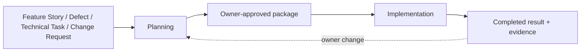

# Bearing Delivery Lifecycle Alignment Design

## Design lenses

- `Lifecycle coherence`
- `Authority separation`
- `Deterministic projection`
- `Provider-neutral portability`
- `Fast bounded resumption`

## Context

Bearing Lite is a skills-first Agent Plugins package. Markdown and JSON artifacts carry durable intent and authority. Host adapters may enforce a subset of lifecycle events, but no host hook becomes the workflow authority.

The sketch below is a non-normative illustration of the same ordered contract. It is an example only: it mandates no diagram dialect, tool, or modeling format.

## Contracts

### DES-BDL-001 — Public lifecycle

The README is the concise onboarding and orientation surface. `docs/architecture/bearing-delivery-lifecycle.md` explains the lifecycle. Per `DEC-BDL-064`, HTML is the DoD Manifest output only; the three standalone process HTML pages were deleted and must not be recreated. The retained `docs/architecture/bearing-process/lifecycle-context.svg` and `docs/architecture/bearing-process/lifecycle-process-views.svg` are derived, non-normative accessible views of the same ordered contract. The text contracts remain authoritative.

### DES-BDL-002 — Planning control

Planning uses Intake → Architectural Alignment → Scope Definition → factual initial frame → Integration Engineer planning input → concurrent Systems Modeler and Test Engineer planning work → deterministic consistency check → at most one targeted specialist reconciliation → mechanical Plan Integrator → one planning review → owner authorization. The Orchestrator checks completeness, IDs, dependencies, authority, and evidence presence only.

### DES-BDL-003 — Role/session model

Profiles nest sessions beneath stable role identities. `test_engineer.planning` authors V&V and `test_engineer.assurance` independently assesses the exact candidate. `integration_engineer.planning` owns integration planning and `integration_engineer.execution` independently performs final system-level validation and integrated technical assessment. Surveyor is removed.

### DES-BDL-004 — Persistent profile

`~/.agents/bearing-lite/profiles.json` is the only persistent user configuration. The shipped `profiles.json` is an empty valid catalog. `profiles.schema.json` validates nested role/session routes, fallbacks, strategy, cadence, concurrency, clean-session handoff, holds, and deterministic-verification backends. Normal runtime never reads legacy lineup paths.

### DES-BDL-005 — Explicit migration and onboarding

`onboard-bearing` inspects an existing profile, asks one setting at a time, writes only explicit choices atomically, validates readback, and stores no credentials. A legacy lineup returns `MIGRATION_REQUIRED`; migration preserves meaning, asks for the Integration Engineer execution route, validates the new profile, then removes legacy configuration.

### DES-BDL-006 — Implementation scheduling

`single_implementer` is the speed default. `tdd` orders Test Implementer before Product Implementer for a behavior-changing slice. Independent dependency-ready slices may run concurrently when write sets and mutable resources do not overlap. Unsettled interfaces finish planning before dispatch.

### DES-BDL-007 — Assurance and review

Cadence values are `slice`, `phase`, or `lifecycle`. Defaults are `phase` for Test Engineer assurance, `phase` for Reviewer, and `lifecycle` for Integration Engineer execution. A declared boundary runs each enabled session once, allows one aggregated repair, then uses deterministic closure without automatic rereview.

### DES-BDL-008 — Deterministic verification adapter

A verification request binds candidate, claim, backend, stage, authority, expected result, and command/configuration. A receipt returns `VERIFIED`, `REFUTED`, `INCONCLUSIVE`, or `ERROR` with candidate identity, backend/version, evidence, and digest references. Author-produced receipts are diagnostic; an independent assurance session must rerun required claims.

### DES-BDL-009 — Definition of Done Manifest

`implementation.json.dod_manifest` is the structured rendering input. A Node.js standard-library renderer combines it with a versioned fixed template and writes `<plan-name>-dod-manifest.html`. The renderer escapes text, renders fixed tables and nine ordered sections, embeds sanitized inline SVG or data-URI PNG views, computes visible status, and supports `--check` byte comparison.

### DES-BDL-010 — Planning/closeout immutability

The planning projection is digest-bound. Closeout appends actual candidate, paths, results, evidence, documentation completion, anomalies, repair/recovery, residual gaps, and acceptance state. It does not rewrite approved planning meaning. A planning change requires an owner-approved amendment.

### DES-BDL-011 — Host portability

The root `plugin.json` uses only Agent Plugins 1.0 fields. Shared skills remain in `skills/`. GitHub Copilot/VS Code hooks live under `com.github.copilot/hooks/hooks.json`. Existing host-specific manifests remain compatibility surfaces. Muse Code uses its native Agent Skills install/import path and validates every shipped skill against its supported common subset.

### DES-BDL-012 — Resume behavior

Resume reads `journey.json`, `workspace.md`, the active role contract, and current task. It performs one host-native liveness check when available and classifies RUNNING, COMPLETED, INACTIVE, or UNKNOWN. It never adds a watchdog daemon or replays accepted planning.

## Interfaces

| ID | Producer | Consumer | Contract |
|---|---|---|---|
| CONTRACT-BDL-001 | `onboard-bearing` | Orchestrator | Valid `profiles.json` snapshot with explicit settings only. |
| CONTRACT-BDL-002 | Planning specialists | Plan Integrator | Stable IDs, deltas, integration handoffs, V&V cases, and documentation impact. |
| CONTRACT-BDL-003 | Plan Integrator | Implementers | `implementation.json` slices with exact references, dependencies, write sets, commands, authority, and stop conditions. |
| CONTRACT-BDL-004 | Renderer | Human reviewer | Self-contained accessible HTML projection with fixed structure and explicit missing/N/A states. |
| CONTRACT-BDL-005 | Implementer | Test Engineer assurance | Exact stable candidate plus diagnostic evidence that does not grant PASS. |
| CONTRACT-BDL-006 | Test Engineer assurance | Reviewer | Candidate-bound V&V results and unresolved anomalies. |
| CONTRACT-BDL-007 | Reviewer | Integration Engineer execution | Stable reviewed candidate plus defect disposition and deterministic closure evidence. |
| CONTRACT-BDL-008 | Integration Engineer execution | Owner | System-level validation and integrated technical assessment against the approved outcome. |

## Model views

Modeling is configurable and optional (`DEC-BDL-064`). This design mandates no
modeling format: no Mermaid, no JSON diagram dialect, and no particular tool.
Where native SysML is the selected mode, the SysML model remains the semantic
authority and any rendered image is a digest-bound human projection
(`DEC-BDL-048`). The modeling mode for each model row is stated by the Systems
Modeler on that row and is never chosen or rewritten by the renderer or by this
design.

The authoritative semantics of this Lifecycle are the text contracts above. The
context sketch in this document and the retained
`docs/architecture/bearing-process/*.svg` files are derived, non-normative human
views; they are not a SysML model and must not be presented as one. A model view
that a row marks selected or required, and that is missing or digest-stale, is a
visible verification failure inside the DoD Manifest (`DEC-BDL-046`). A row
marked not applicable stays visible with its reason; an explicitly inactive row
needs no view. No standalone public process page carries these semantics.

## Risks and recovery

| Risk | Control | Recovery |
|---|---|---|
| Terminology drift across distributed contracts | Focused cross-file conformance test | Repair the shared role/profile vocabulary once, then rerun full suite. |
| Manifest varies by model | Fixed template, escaped renderer, deterministic ordering and `--check` | Reject stale output and rerender from frozen input. |
| Legacy configuration silently reactivates retired roles | `MIGRATION_REQUIRED`; no legacy fallback | Run explicit onboarding migration and validate readback. |
| Host claims exceed native support | Document and test only observed paths | Mark missing hook enforcement procedural; keep skill workflow usable. |
| Orchestrator enters a review loop | One classification and one bounded repair | Return remaining material conflict to owner. |
