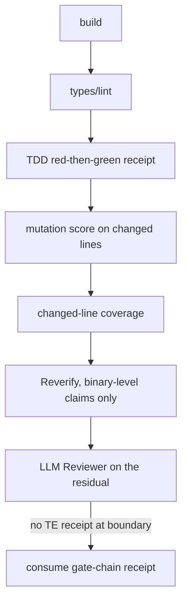

# Assurance gate chain and review flow — Design

How the technical plan is built. No new dependencies, no concrete
provider/model names in public artifacts, no new schemas.

## Context and boundary

Bearing Lite is policy-block + evaluator-hook mirrors + skill prose + JSON
schemas, verified by `node:test` suites and a drift test. This Lifecycle adds
a deterministic gate chain in front of LLM assurance, an evidence rule for
Reviewer findings, a mixed-cadence consumption rule, a manifest gate before
owner review, a digest-pin sweep, and Orchestrator-owned alignment. All seams
are inside `skills/`, `hooks/`, and `test/`; schemas and the manifest
renderer are untouched.

## Operational flow

Each box is fail-fast: declared-but-missing or `not_run` is a typed gap,
never PASS.

## Design lenses

- `Gate-chain`: ordered deterministic gates and their mirror.
- `Receipt-contract`: receipt shapes and consumption rules.
- `Review-gate`: owner-review presentation guard.
- `Pin-hygiene`: cite-by-reference instead of digest copies.
- `Ownership`: who may write locked planning artifacts.

## Decisions

- DES-143.01 (Gate-chain): gate order lives in the `assurance-policy.md`
  JSON block (authoritative) with an exact mirror in
  `hooks/assurance-budget.cjs` + `hooks/policy.cjs`, held by the existing
  drift test. Mutation/coverage thresholds are per-plan `seit.json`
  declarations naming the target repository's own tool; undeclared gates
  require `NOT_APPLICABLE` with reason.
- DES-143.02 (Gate-chain, Receipt-contract): mutation, changed-line
  coverage, and red-then-green are a documented claim-type vocabulary in the
  Test Engineer skill and `references/verification.md`, not a
  `seit.schema.json` enum change: `method` stays `contentfulString` so
  existing plans keep validating. Typed-gap outcomes are defined per claim
  type; the Assurance session reruns them; author receipts stay diagnostic.
- DES-144.01 (Receipt-contract): actionable/advisory is encoded in
  `skills/reviewer/SKILL.md` prose plus the frozen receipt's existing
  `reproducer` + location fields, covered by a conformance test. No new
  Reviewer receipt schema: none exists today, and a schema would add a
  machine authority the reviewers (LLM skills) cannot enforce themselves.
- DES-145.01 (Receipt-contract): the mixed-cadence rule is one sentence in
  the policy block and the Reviewer skill: consume the most recent
  gate-chain receipt for the unit when no TE receipt exists. No profile
  schema constraint (rejected alternative: it would forbid a combination the
  owner chose to support per DEC-AGR-008).
- DES-136.01 (Review-gate): the guard lives in
  `evaluatePlanningReview()` — the single procedural gate before review
  presentation — returning `NEEDS_MORE_EVIDENCE` /
  `manifest_not_generated` when `dod_manifest` or its rendered HTML is
  absent. No new host adapter: `planning-review.cjs` is procedural, not
  host-wired, so "propagation" is the skill step referencing this guard.
- DES-135.01 (Pin-hygiene): `plan-package.cjs` gains a literal sweep of the
  repository write set comparing live pins against the recorded baseline
  digest/commit. Allow-list = paths under gate-evidence/dated-receipt
  locations plus values carrying a `HISTORICAL_GATE`-set marker (reuse the
  existing set, no new vocabulary). Guidance (artifact-grammar register
  section) states the cite-don't-copy rule: reference `authority.json` or
  the bound host instead of duplicating digests.
- DES-146.01 (Ownership): `workspace.md`/`repository-map.md` move to
  Orchestrator-writable in `orchestrator-write-lock.cjs`; the Architectural
  Alignment skill states Orchestrator ownership. Remaining locked artifacts
  keep role enforcement; the hook reads an in-process subagent role from the
  host envelope when present, else the deny message names the separate
  process + `BEARING_ROLE` fallback.

## Use cases and outcomes

- A diff that fails types never spends a Reviewer turn (fail-fast).
- A finding without `file:line` + reproducer is advisory and cannot block.
- A phase Reviewer with lifecycle TE assurance still has a receipt to
  consume.
- No owner review is requested before the manifest exists.
- A one-byte register move fails fast with `file:line` pins, not a review
  round.
- The Orchestrator maps the repo without spawning a second process.

`diagram_not_required` for state views: the only stateful addition is the
manifest presence check, a single boolean in DES-136.01.
